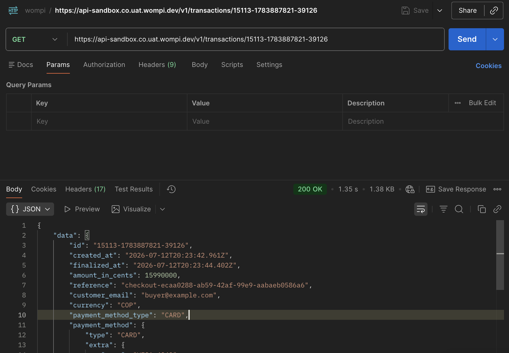
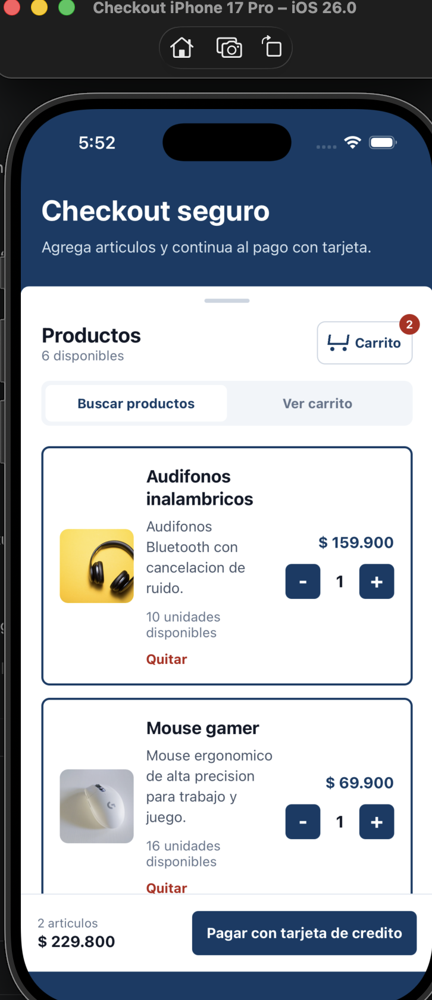
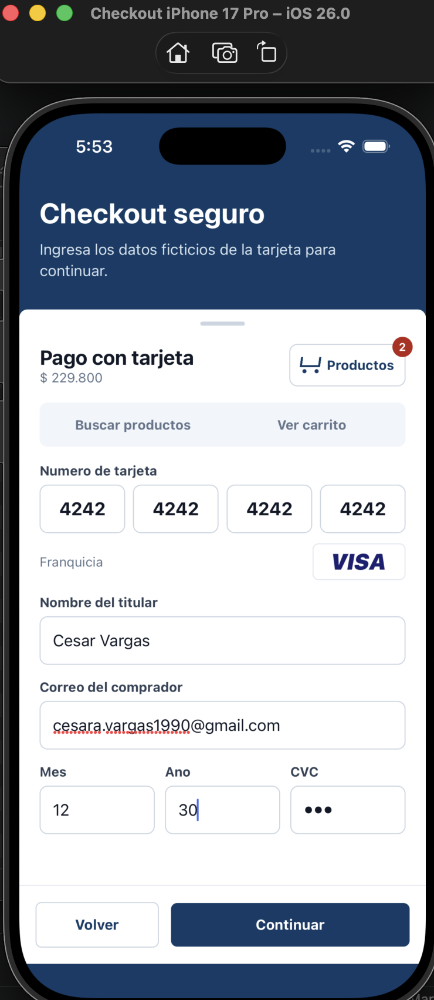
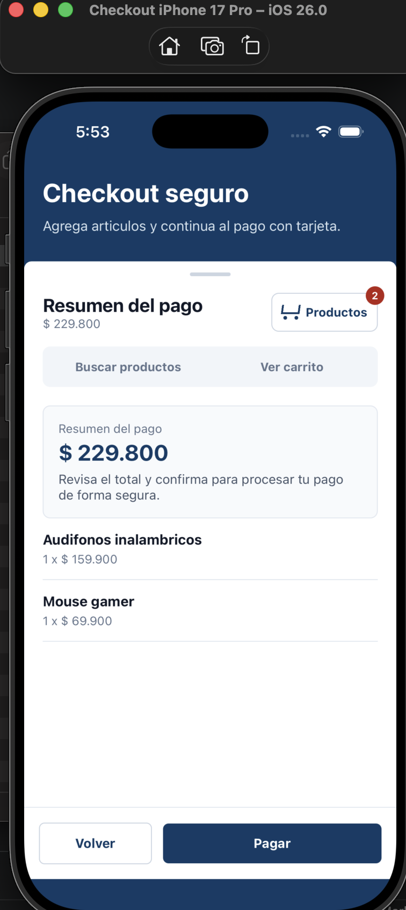
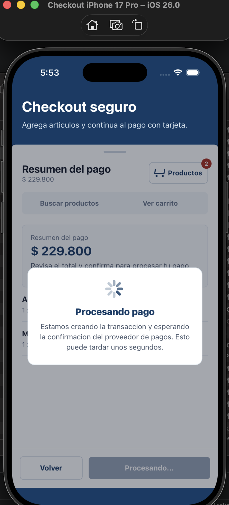
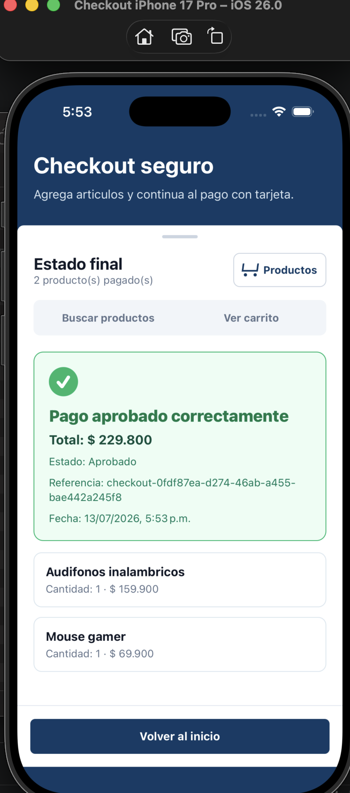

# Fullstack Payment POC

Aplicación fullstack para un checkout móvil con carrito, pago con tarjeta, backend NestJS, MySQL e integración configurable con una API externa de pagos.

## Estructura

```text
.
├── backend/   # API NestJS + MySQL + arquitectura por capas
├── frontend/  # App React Native 0.86.0
└── docker-compose.yml
```

## Flujo implementado

1. Splash screen nativo.
2. Catálogo de productos consumido desde `GET /products`.
3. Carrito funcional con 1 a N artículos.
4. Checkout con formulario de tarjeta en una interfaz tipo Backdrop.
5. Validación de tarjeta: Visa/Mastercard, Luhn, expiración, CVC, titular y correo.
6. Resumen de pago con confirmación.
7. Una sola transacción por carrito:
   - se crea localmente en `PENDING`;
   - se procesa contra la API externa de pagos;
   - se actualiza con el estado final;
   - si queda aprobada, se descuenta inventario.
8. Pantalla final con resultado, referencia, fecha de cambio de estado y productos pagados.

## Evidencia visual

Las capturas muestran el flujo principal de la prueba: consumo de la API externa de pagos, selección de productos, formulario de tarjeta, resumen, procesamiento y estado final.

| Consumo de API externa de pagos | Carrito de productos |
|---|---|
|  |  |

| Pago con tarjeta | Resumen del pago |
|---|---|
|  |  |

| Procesando pago | Pago aprobado |
|---|---|
|  |  |

## Ejecutar todo con Docker

Desde la raíz:

```bash
docker compose --env-file backend/.env up --build
```

Servicios:

```text
API:   http://localhost:3000
MySQL: localhost:3306
```

## API publicada en nube

La API del backend está publicada temporalmente en una instancia **AWS EC2** para validación de la prueba técnica:

```text
http://ec2-18-217-182-29.us-east-2.compute.amazonaws.com:3000
```

Endpoint de verificación:

```bash
curl http://ec2-18-217-182-29.us-east-2.compute.amazonaws.com:3000/products
```

La app móvil usa esta URL como `API_BASE_URL` en:

```text
frontend/.env
```

Ejemplo:

```dotenv
API_BASE_URL=http://ec2-18-217-182-29.us-east-2.compute.amazonaws.com:3000
```

### Nota para iOS y App Transport Security

Si `API_BASE_URL` usa HTTP o un dominio nuevo, valida la configuración de App Transport Security en:

```text
frontend/ios/CheckoutApp/Info.plist
```

Para esta prueba técnica se permite tráfico HTTP durante desarrollo. En producción se recomienda exponer la API por HTTPS y endurecer la configuración de ATS. Si cambias a un dominio propio o a HTTPS, actualiza `frontend/.env`, regenera la configuración con `npm run generate:env` y reconstruye la app iOS.

El despliegue usa Docker Compose en EC2 con dos servicios:

- `checkout-api`: backend NestJS expuesto en el puerto `3000`.
- `checkout-mysql`: MySQL disponible solo dentro de la red Docker.

### Primer despliegue en EC2

El archivo `backend/.env` no se versiona porque puede contener llaves reales. En un servidor nuevo debes crearlo manualmente desde el ejemplo:

```bash
cd ~/fullstack-payment-poc
cp backend/.env.example backend/.env
nano backend/.env
```

Configura ahí las variables reales del ambiente:

```dotenv
PORT=3000

DB_HOST=localhost
DB_PORT=3306
DB_USER=checkout
DB_PASSWORD=checkout
DB_NAME=checkout
MYSQL_ROOT_PASSWORD=change-me

PAYMENTS_MODE=external
PAYMENT_PROVIDER_BASE_URL=replace-with-provider-api-base-url
PAYMENT_PROVIDER_PUBLIC_KEY=replace-with-public-key
PAYMENT_PROVIDER_PRIVATE_KEY=replace-with-private-key
PAYMENT_PROVIDER_INTEGRITY_SECRET=replace-with-integrity-secret
PAYMENT_PROVIDER_POLL_ATTEMPTS=5
PAYMENT_PROVIDER_POLL_INTERVAL_MS=1000
```

Aunque `DB_HOST` quede como `localhost` en `backend/.env`, Docker Compose lo sobrescribe a `mysql` para el contenedor `api`.

Levanta o actualiza los contenedores con:

```bash
docker compose --env-file backend/.env up --build -d
```

Las llaves reales no se versionan. Para desarrollo local pueden ir en `backend/.env`, que está ignorado por Git.

## Ejecutar backend local

```bash
cd backend
npm install
cp .env.example .env
npm run start:dev
```

Más detalle y curls: [backend/README.md](backend/README.md).

## Ejecutar frontend móvil

```bash
cd frontend
nvm use
npm install
cd ios
pod install
cd ..
npm run ios
```

Más detalle para iOS/Android: [frontend/README.md](frontend/README.md).

## Pruebas y cobertura

Backend:

```bash
cd backend
npm test
npm run test:cov
```

Frontend:

```bash
cd frontend
npm test -- --runInBand
npm run test:cov
```

Estado actual de cobertura:

| Proyecto | Tests | Statements | Branches | Functions | Lines |
|---|---:|---:|---:|---:|---:|
| Backend | 32 passing | 100% | 88.88% | 100% | 100% |
| Frontend | 29 passing | 96.61% | 91.66% | 94.28% | 98.19% |

El umbral configurado en Jest es 80% global para `statements`, `branches`, `lines` y `functions`.

## GitHub Actions

Workflows activos:

- `.github/workflows/backend-tests.yml`
  - instala dependencias;
  - compila backend;
  - ejecuta tests con coverage;
  - sube artefacto `backend-coverage`.
- `.github/workflows/frontend-tests.yml`
  - instala dependencias;
  - ejecuta TypeScript;
  - ejecuta tests con coverage;
  - sube artefacto `frontend-coverage`.

## Notas de seguridad

- La app móvil no contiene llaves privadas.
- La llave privada y el secreto de integridad viven solo en backend vía variables de entorno.
- `backend/.env` está ignorado por Git.
- El repositorio versiona únicamente placeholders en `.env.example`.
